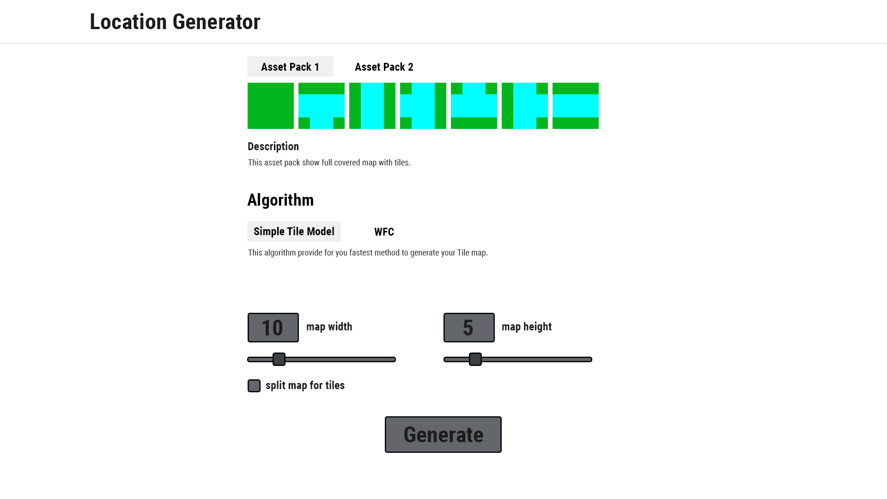
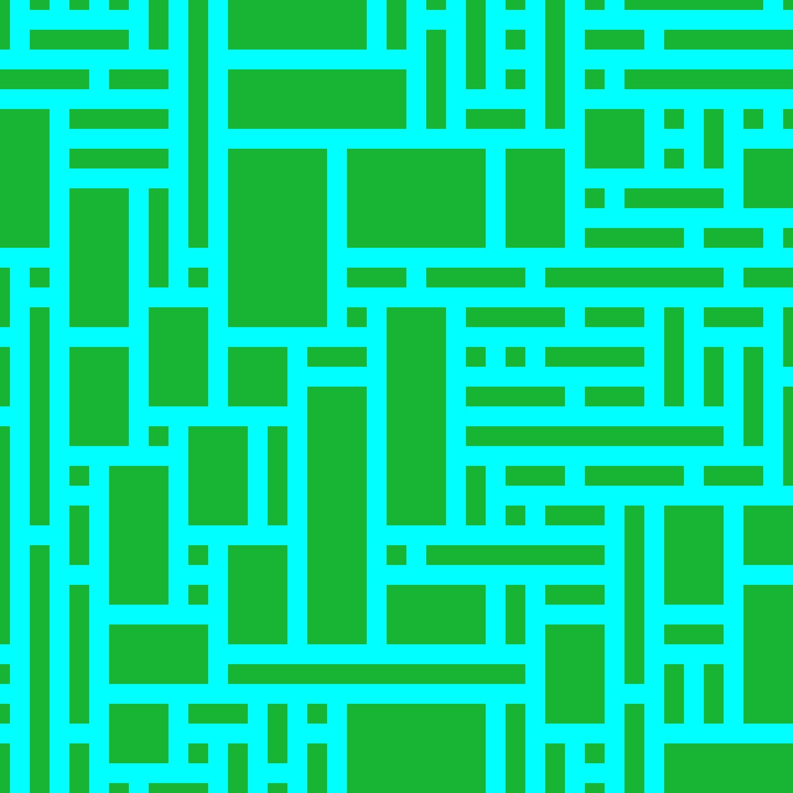
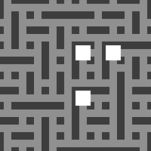
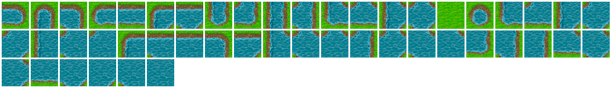
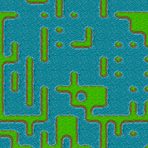
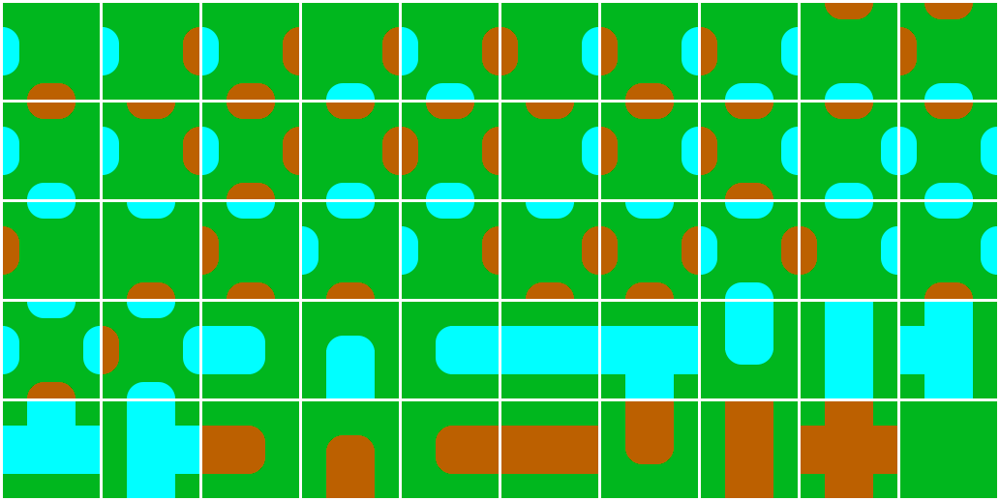
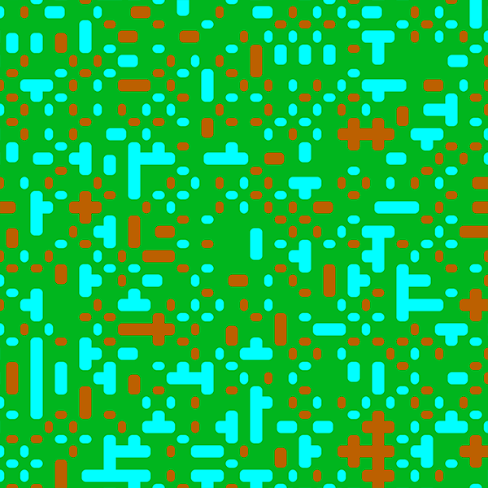
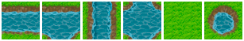
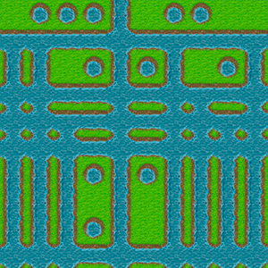

# (ENG) The simple generator of 2D maps and patterns with PHP

## [Demo](https://joqer.ru)

---

## Examples of 2D images and assets for creating them

#### 1. Simple 100*100px assets. The image created with these assets has no empty areas:

 

#### 2. Simple 100*100px assets. In most cases, collisions occur due to an incomplete assets pack:

 

#### 3. Simple 48*48px assets make the map look like a 2D top-down strategy game.

 

#### 4. The asset pack with many compatible tiles causes the map to collapse into local areas. This is doesn't allow you to make complex and beautiful patterns.

 

#### 5. A little part of assets from "Real land" asset pack. An image will be created with simple and repeatable patterns.

 

---

### Application structure:
1. The map generation application is located in the directory `src/App/`
2. The application **Backend** and **frontend** is located in folders `src/backend/` and `src/frontend/`.
   They are not part of the map generation application and its are used to only for demonstration purposes only.
3. The entry point is located in the folder `src/public`. Generation assets is in the `src/public/assets/` and new generated images are in the `src/public/saved/`.
4. The `tests/Functional/` and `tests/Unit/` folders contain the application's Feature and Unit tests, respectively.

---

### The structure of the main Map Generator classes:

### Namespace `App/Asset`

#### 1. Asset
Path - `src/App/Asset/Asset.php`

The asset class is responsible for the operation of single asset that will be part of the generated map.

The name of single asset must follow the template below: 
`##_##_##_##_##_##`  
or short version if all asset sides are of the same type: 
`##_##_##` if the second `##` is equals 1 

Underscore is used as delimiter `_`

**Each `##` has its own meaning depending on the position:**
* position 0 - the title type (not type of side), for example, it can be: corners, roads, rivers, mountains etc.
* position 1 - all sides of an asset are of the same type (1) or different (2)
* position 2 - the type of the top side (full version of the description) / the type of all sides (for short version of the description)
* position 3 - the type of the right side (full version of the description)
* position 4 - the type of the bottom side (full version of the description)
* position 5 - the type of the left side (full version of the description)

#### 2. AssetsCollection
AssetsCollection is used to working with the group of assets. It's necessary to get the assets collection that will be used to generate the current map.

#### 3. AssetFolder
AssetFolder is used to working with one folder with assets.

#### 4. AssetFolderCollection
AssetFolderCollection is used to get a collection of folders with assets.

### Namespace `App/Generator`

#### 1. Algorithm/SimpleTileBuilder
This is an example of the Map Generator's implementation according to a certain algorithm.
In this case it's a Simple Tile Model that compares all sides of the current asset to the sides of other assets.
After a certain number of correct tiles are selected, a specific tile from this group is randomly selected.

### Namespace `App/Map`

#### 1. Map
This is the object that consist of many other small tiles. Each single tile in the map has its own coordinates and its own asset.
The map also has dimension of X by Y tiles.

#### 2. Tile
This is part for a map that has its own asset, its own dimension in pixels, the type of each side and the coordinates in the map.

### Namespace `App/MapSaver`

#### 1. MapSaver
MapSaver is the helper class for saving a map as an image with different types (jpg, png, webp).
It's also possible to save the map as divided images or one single image.

### Namespace `App/backend`

Here are the following components:
- `route.php` - the Symfony component for handling requests coming from frontend.
- `Controllers/` - all controllers that redirect requests to appropriate services.
- `Services/` - this is the logic components for Map Generator application that is required for the frontend to work properly.

---

## Work with 2D Map Generator

1. **Project setup (without Docker, if you have Apache/NGINX webserver and PHP above 7.4 version):**
    1. Clone the repository: `git clone git@github.com:quoterbox/php-2d-location-generator.git`
    2. Install required packages from Composer: `composer install`
    3. In most cases, you can start the project from your web sever at http://localhost:8080 or another address that depends on your web server.
    4. Also, you can start the project without the frontend at `http://localhost:8080/index_no_frontend.php`
2. **Developing:**
    1. NPM and NodeJS is required to build the frontend.
    2. Install NPM dependencies: `npm install`
    3. Use one of the commands from `package.json` to build the frontend, for example: `npm run dev` или `npm run prod`.
    4. More frontend build settings can be set in the `webpack.mix.js` file using a wrapper over Webpack - Laravel-mix.
3. **Tests:**
    1. Use this command to start tests: `composer test`

# (RU) Простой генератор 2D карт, паттернов на PHP

## [Демо](https://joqer.ru)

---

## Примеры ассетов и получающихся из них 2D карт

#### 1. Простые ассеты 100 на 100 пикселей. Без возникновения возможных пустых областей:

 

#### 2. Простые ассеты 100 на 100 пикселей. В большинстве случаев возникают коллизии, из-за неполного набора ассетов:

 

#### 3. Ассеты 48 на 48 пикселей для создания карты, напоминающей 2D стратегию с видом сверху.

 

#### 4. Ассеты с множеством подхдящих друг к другу тайлов создают карту, которая быстро "схлапывается" в локальные области и не позволяет создать сложные визуальные структуры.

 

#### 5. Сильно сокращенное количество ассетов из 3-го набора. В итоге генерируется однообразная и простая карта.

 

---

### Структура приложения:
1. Само приложение генерации карт находится в папке `src/App/`
2. **Backend** и **frontend** приложения находится, соответственно, в папках `src/backend/` и `src/frontend/`.
Они не являются частью приложения-генератора и служат только для демонстрации его работы.
3. В папке `src/public` находится точка входа, ассеты для генерации (`src/public/assets/`) и сохраняемые карты при генерации (`src/public/saved/`).
4. В папках `tests/Functional/` и `tests/Unit/` находятся, соответственно, функциональные и юнит тесты приложения.

---

### Структура основных классов генератора:

### Пространство имен `App/Asset`

#### 1. Asset
Путь - `src/App/Asset/Asset.php`

Отвечает за работу каждого отдельного ассета, который будет являться частью сгенерированной карты.

Наименование ассетов должно следовать шаблону: 
`##_##_##_##_##_##`  
или укороченная версия, когда все стороны одного типа 
`##_##_##` если 2-й параметр равен 1 

В качестве разделителя используется символ нижнего подчеркивания `_`

**Каждая группа `##` имеет свое значение в зависимости от позиции:**
* position 0 - тип тайла (не путать с типом стороны тайла), например это могут быть: угол, прямая, река, поле, горы и тд.
* position 1 - все стороны ассета одного типа (1) или разного (0)
* position 2 - тип верхней стороны (для полного описания) / тип всех сторон (для краткой версии)
* position 3 - тип правой стороны (для полного описания)
* position 4 - тип нижней стороны (для полного описания)
* position 5 - тип левой стороны (для полного описания)

#### 2. AssetsCollection
Отвечает за работу группы ассетов, необходим для получения коллекции ассетов, которые будут использоваться для генерации текущей карты.

#### 3. AssetFolder
Отвечает за работу с одной папкой с ассетами.

#### 4. AssetFolderCollection
Отвечает за получение коллекции папок с ассетами.

### Пространство имен `App/Generator`

#### 1. Algorithm/SimpleTileBuilder
Пример реализации генератора карты по определенному алгоритму. В данном случае это простая тайловая модель, которая подбирает каждый тайл для карты смотря на стороны соседних тайлов.
После того, как отобрано некоторое количество подходящих тайлов, случайным образом происходит выбор конкретного тайла.

### Пространство имен `App/Map`

#### 1. Map
Объект, который состоит из множества других - тайлов. Каждый тайл в карте имеет свои координаты и свой ассет.
Карта также имеет размерность X на Y тайлов.

#### 2. Tile
Составная часть для карты, имеющая свой ассет, свои размеры в пикселях, тип каждой стороны и координаты в составе карты.

### Пространство имен `App/MapSaver`

#### 1. MapSaver
Вспомогательный класс для сохранения карты ввиде изображения произвольного формата. Также есть возможность сохранять карту в ввиде отдельных тайлов или одним файлом.

### Пространство имен `App/backend`

Здесь находятся:
- `route.php` - содежит компоненты роутинга Symfony, для обработки запросов поступаемых от фронтенда.
- `Controllers/` - содержит все контроллеры, перенаправляющие запросы на соответствующие сервисы.
- `Services/` - содержит логику работы примера приложения генератора карт, которая необходима для правильной работы фронтенда.

---

## Работа с 2D генератором

1. **Установка проекта (без Docker, если у вас есть Apache/NGINX webserver и PHP не ниже 7.4):**
   1. Клонируйте репозиторий: `git clone git@github.com:quoterbox/php-2d-location-generator.git`
   2. Установите все требуемые пакеты из Composer: `composer install`
   3. Запустить проект обычно можно из вашего веб сервера по адресу http://localhost:8080 либо другим аналогичным способом.
   4. Вы можете запустить проект без фронтенда по адресу `http://localhost:8080/index_no_frontend.php`
2. **Разработка:**
   1. Для сборки фронтенда вам необходимо установить менеджер пакетов NPM и сервер NodeJS
   2. Установите зависимости NPM: `npm install`
   3. Для билда фронтенда можно использовать одну из команд из файла package.json, например, `npm run dev` или `npm run prod`
   4. Более подробные настройки билда фронтенда можно установить в файле webpack.mix.js иcпользующем обертку над Webpack - Laravel-mix
3. **Тесты:**
   1. Тесты запускаются простой командой: `composer test`

## LICENSE
[MIT License](./LICENSE.md)

## Author
[JQ/Quoterbox](https://github.com/quoterbox)
